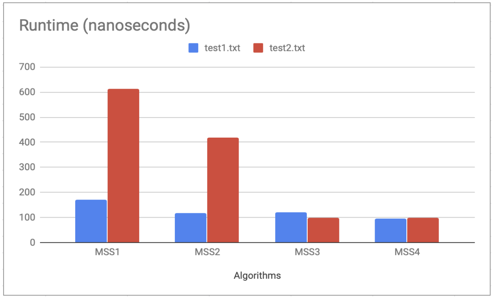
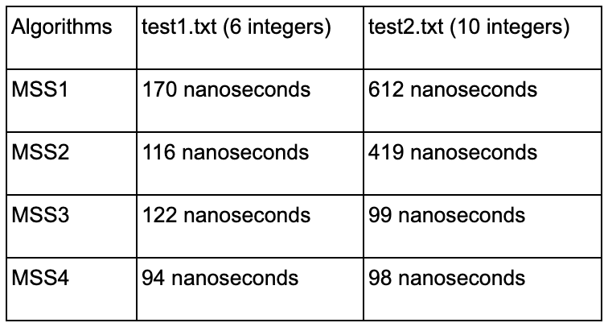

# Maximum Subsequence Sum Analysis
In this project, we investigate four different algorithms for solving the maximum subsequence sum problem: MSS1, MSS2, MSS3, and MSS4. Each algorithm employs a distinct approach, ranging from brute-force techniques to more sophisticated divide-and-conquer strategies.

Through analysis and experimentation, we aim to:
- Compare the efficiency of each algorithm in terms of time complexity.
- Identify the strengths and weaknesses of different approaches.
- Draw insights into how algorithmic choices impact computational performance.

Additionally, we assess the performance of these algorithms using two sets of test data (test1.txt and test2.txt), each containing a different number of integers.

# MSS1:
To find the maximum subsequence sum this algorithm utilizes 3 nested loops. The first loop sets the index i. The second loop sets the index j. Finally, the last loop sums the subsequence

# MSS2:
To find the maximum subsequence sum this algorithm utilizes 2 nested loops. The first loop sets the index i. The second loops sets the index j and sums the subsequence. 

# MSS3:
To find the maximum subsequence sum this algorithm utilizes a divide and conquer method. First we read a series of numbers into an array and partition the array into two “equal” halves - left and right. After, we compute the maximum subsequence sum of the left half and do the same for the right half using a recursion. Finally, we return the maximum subsequence sum of the maximum subsequence sums of the left and right halves.

# MSS4:
To find the maximum subsequence sum this algorithm makes improvements to MSS2. In an optimal subsequence the subsequence should start at a positive number. In MSS2, i and j point to the start and end of the current sequence. So if the integer in current index i in the array is negative then it can’t possibly represent the start of an optimal subsequence. Using this information we can conclude that any subsequence with a negative sum can’t be a prefix of an optimal subsequence. So we really don’t need to maintain the index i.

# Conclusion

From my analysis of the four methods I can conclude that MSS4 is the most efficient with MSS3 being the second most, MSS2 being the third most and MSS1 being the least. From my test runs I was able to see that the program took more time with calculating the maximum subsequence sum with test2.txt because there were more integers in that file than in test1.txt. However, I noticed that MSS2 was faster than MSS3 when I used them on test1.txt. I assume this might be because the MSS3 algorithm encountered a worst case scenario, making the time it took for it to calculate the maximum subsequence sum 6 seconds slower than the time it took for MSS2 to calculate it. Apart from that the trend seems to show that MSS4 is indeed the fastest with MSS1 being the slowest and MSS2 and MSS3 being the second and third slowest respectively.

